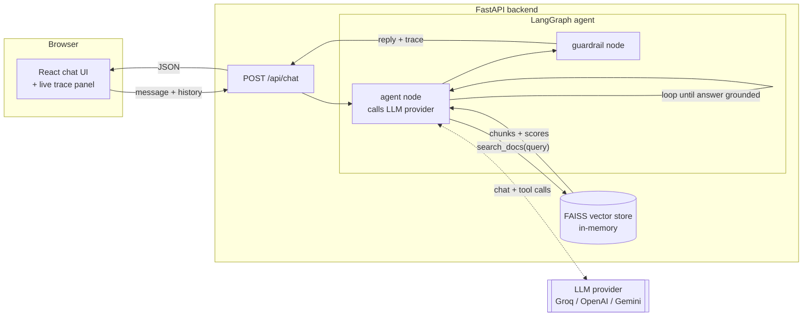
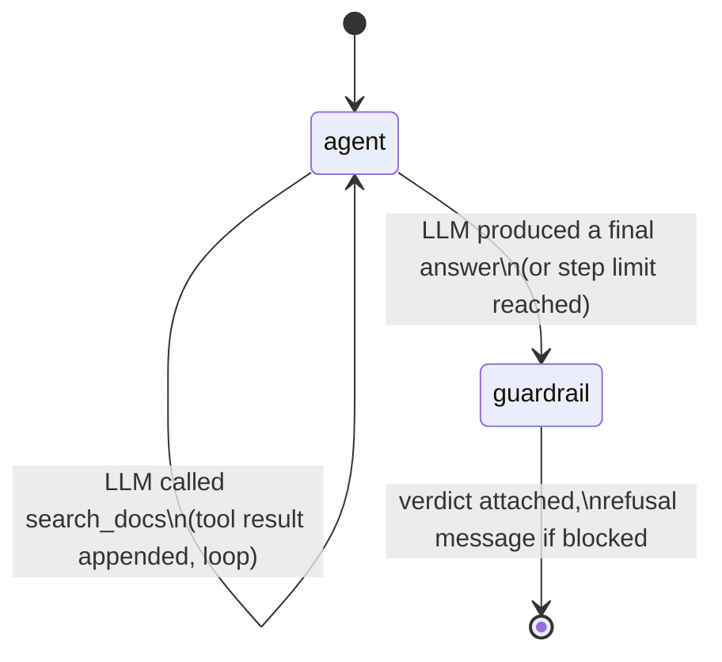

# Nimbus RAG Assistant — an observability-first agentic RAG demo

A small agent that answers questions from your own documents — and, unlike most RAG demos, shows its work: what it retrieved, what it scored, which tools it called, how long each step took, how many tokens it spent, and whether a guardrail let the answer through.

**Why this exists:** most people don't trust AI answers they can't inspect. This project takes the observability practices used in production LLM systems (tracing, evaluation, guardrails) and puts them directly in front of the end user instead of hiding them in an internal dashboard.

Live: _add your deployed URL here once shipped_
Repo: https://github.com/gvdnikhil/rag-observability-agent

## What it does

1. You ask a question in the chat UI.
2. The agent (built on **LangGraph**) decides whether it needs to search the knowledge base, and calls a `search_docs` tool if so — it can call it more than once if the first search wasn't enough.
3. Retrieval runs against a **FAISS** index built from local embeddings (`sentence-transformers`, no API cost).
4. A **guardrail** checks the retrieved evidence before the answer ships: if nothing relevant was found, or the best match is below a similarity threshold, the agent refuses instead of guessing.
5. The frontend renders the full trace next to the chat: retrieved chunks with similarity scores, tool calls made, per-call latency, token usage, and the guardrail's verdict.

## Architecture



### Agent loop (inside the LangGraph graph)



Every pass through the `agent` node is one LLM call and is recorded as one trace step (latency + token usage + whether it called a tool). The `guardrail` node runs exactly once, after the loop ends, and inspects everything that was retrieved across all iterations — not just the last one.

## Why these specific choices

| Decision | Why |
|---|---|
| **FAISS in-memory, rebuilt on boot** | No external vector DB to run or pay for at this content size. Rebuild cost is milliseconds for a handful of docs. |
| **`sentence-transformers` for embeddings** | Runs locally, free, no API key — only the *generation* step costs anything, and that's on a free tier too. |
| **LangGraph for orchestration** | The retrieve → guardrail → generate loop is genuinely stateful (it can loop), which is what LangGraph is for — a plain function chain can't express "call the tool again if the first search wasn't enough." |
| **Custom `LLMProvider` abstraction instead of calling Groq's SDK directly** | Swapping to OpenAI or Gemini is an env var change (`LLM_PROVIDER`), not a rewrite — see `backend/app/llm/`. |
| **Guardrail is a similarity threshold, not GuardrailsAI** | Same *category* of protection (refuse instead of hallucinate) without the extra dependency weight for an MVP. Documented as the first thing to swap in if this grows into something more serious. |
| **Trace returned inline in the API response, not shipped to Prometheus/Grafana** | The audience for the trace is the end user, not an ops team — so it's rendered directly in the product instead of a separate observability stack. |

## Project structure

```
backend/
  app/
    main.py           FastAPI app, /api/chat and /api/health
    agent/graph.py     LangGraph agent loop + system prompt + tool schema
    llm/               provider abstraction (base.py, openai_compatible.py, gemini_provider.py, factory.py)
    rag/               ingest.py (chunking) + store.py (FAISS wrapper)
    guardrails.py      grounding check
    observability.py   trace object + summary stats
    data/docs/         sample knowledge base (swap for your own notes)
frontend/
  src/
    App.jsx            layout + request orchestration
    api.js             fetch wrapper
    components/        ChatPanel, TracePanel, ScoreBar, StatChip, StatusDot
```

## Running locally

**Backend**
```bash
cd backend
python -m venv .venv
.venv\Scripts\activate        # or source .venv/bin/activate on macOS/Linux
pip install -r requirements.txt
copy .env.example .env        # then fill in LLM_API_KEY
uvicorn app.main:app --reload
```

**Frontend**
```bash
cd frontend
npm install
npm run dev
```

Open the frontend URL, ask something answerable from `backend/app/data/docs/` (e.g. "What deployment modes does Nimbus support?"), then ask something unrelated (e.g. "What's the weather today?") and watch the guardrail refuse instead of making something up.

## Swapping in your own knowledge base

Replace the markdown files in `backend/app/data/docs/` with your own notes — the index rebuilds from whatever is in that folder on every backend start. No code changes needed.

## Swapping the LLM provider

Set in `backend/.env`:
```
LLM_PROVIDER=groq | openai | gemini
LLM_API_KEY=...
LLM_MODEL=...        # optional, sensible default per provider
```

## Deployment

- **Backend** → Railway (root directory `backend/`, env vars set in the Railway dashboard).
- **Frontend** → Vercel (root directory `frontend/`, `VITE_API_URL` set to the Railway backend's public URL).
