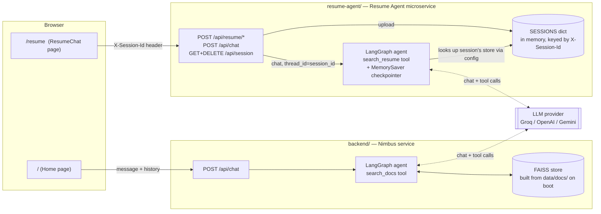
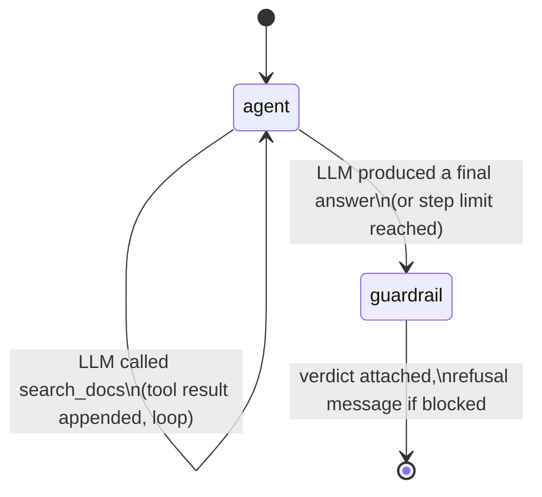
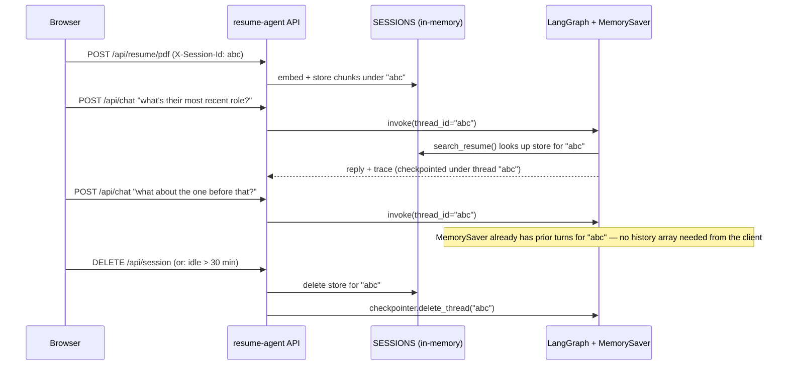

# Observability-first agentic RAG — two services, one frontend

A small ecosystem of agents that answer questions from documents — and, unlike most RAG demos, show their work: what they retrieved, what it scored, which tools they called, how long each step took, how many tokens they spent, and whether a guardrail let the answer through.

**Why this exists:** most people don't trust AI answers they can't inspect. This project takes the observability practices used in production LLM systems (tracing, evaluation, guardrails) and puts them directly in front of the end user instead of hiding them in an internal dashboard.

Repo: https://github.com/gvdnikhil/rag-observability-agent

Two independently-deployed backend **microservices** share one frontend (two pages, one React app):

| Service | Page | What it answers about | Data lifetime |
|---|---|---|---|
| `backend/` (Nimbus) | `/` | A fixed sample knowledge base (`backend/app/data/docs/`) | Rebuilt on every boot, same for everyone |
| `resume-agent/` | `/resume` | Whatever resume *you* just uploaded | Per-browser-session, in memory only, gone on tab close / idle timeout / "Clear my data" |

## What each agent does

1. You ask a question in the chat UI.
2. The agent (built on **LangGraph**) decides whether it needs to search its knowledge base, and calls a tool if so — it can call it more than once if the first search wasn't enough.
3. Retrieval runs against a **FAISS** index built from local embeddings (`sentence-transformers`, no API cost).
4. A **guardrail** checks the retrieved evidence before the answer ships: if nothing relevant was found, or the best match is below a similarity threshold, the agent refuses instead of guessing.
5. The frontend renders the full trace next to the chat: retrieved chunks with similarity scores, tool calls made, per-call latency, token usage, and the guardrail's verdict.

## Architecture



### Nimbus agent loop (`backend/app/agent/graph.py`)



### Resume Agent: session lifecycle + memory (`resume-agent/`)



`sessionStorage` (not `localStorage`) holds the session id client-side, so it disappears when the tab closes — the server-side TTL sweep and the "Clear my data" button cover the cases a closed tab can't (multiple tabs, idle-but-open tabs, crashes).

Every pass through an `agent` node is one LLM call and is recorded as one trace step (latency + token usage + whether it called a tool). The `guardrail` node runs exactly once, after the loop ends, and inspects everything that was retrieved across all iterations — not just the last one.

## Why these specific choices

| Decision | Why |
|---|---|
| **Two separate microservices, not one app with a mode flag** | Different data lifetimes (permanent sample docs vs. ephemeral per-session upload) and different scaling/memory needs (resume-agent does on-demand embedding of arbitrary uploads) — independent deploys mean one can't take the other down or share its failure blast radius. |
| **FAISS in-memory, rebuilt on boot / per session** | No external vector DB to run or pay for at this content size. Rebuild cost is milliseconds for a handful of docs. |
| **`sentence-transformers` for embeddings** | Runs locally, free, no API key — only the *generation* step costs anything, and that's on a free tier too. |
| **LangGraph for orchestration** | The retrieve → guardrail → generate loop is genuinely stateful (it can loop), which is what LangGraph is for — a plain function chain can't express "call the tool again if the first search wasn't enough." |
| **LangGraph `MemorySaver` for the resume agent's conversation memory** | Conversation state (per browser session) is now owned by the checkpointer, keyed by `thread_id = session_id`, instead of the client resending a growing `history` array every request. |
| **Custom `LLMProvider` abstraction instead of calling Groq's SDK directly** | Swapping to OpenAI or Gemini is an env var change (`LLM_PROVIDER`), not a rewrite — see `*/app/llm/` (duplicated per service on purpose — see below). |
| **Guardrail is a similarity threshold, not GuardrailsAI** | Same *category* of protection (refuse instead of hallucinate) without the extra dependency weight for an MVP. Documented as the first thing to swap in if this grows into something more serious. |
| **Trace returned inline in the API response, not shipped to Prometheus/Grafana** | The audience for the trace is the end user, not an ops team — so it's rendered directly in the product instead of a separate observability stack. |
| **`llm/`, `rag/`, `guardrails.py` duplicated into `resume-agent/` instead of a shared package** | Each service stays independently deployable with zero cross-imports — the same reasoning already applied when this repo and the portfolio repo were kept separate rather than sharing code. |

## Project structure

```
backend/                 Nimbus service — fixed sample knowledge base
  app/
    main.py               FastAPI app, /api/chat and /api/health
    agent/graph.py         LangGraph agent loop + system prompt + tool schema
    llm/                   provider abstraction (base.py, openai_compatible.py, gemini_provider.py, factory.py)
    rag/                   ingest.py (chunking) + store.py (FAISS wrapper)
    guardrails.py          grounding check
    observability.py       trace object + summary stats
    data/docs/             sample knowledge base (swap for your own notes)

resume-agent/             Resume Agent microservice — per-session upload
  app/
    main.py                /api/resume/pdf, /api/resume/text, /api/chat, /api/session
    sessions.py             in-memory SESSIONS dict + TTL sweep
    resume_parse.py         PDF -> text (pypdf), with logging + configurable extraction
    agent/graph.py           same LangGraph shape as Nimbus, + MemorySaver checkpointer
    llm/ , rag/ , guardrails.py, observability.py    copied from backend/, unmodified

frontend/                 One React app, two routes
  src/
    main.jsx               react-router-dom routes: "/" and "/resume"
    pages/Home.jsx          Nimbus demo page (was App.jsx)
    pages/ResumeChat.jsx    upload screen -> chat + trace panel, "Clear my data"
    lib/session.js          sessionStorage-backed session id + fetch wrapper
    lib/resumeApi.js         resume-agent API client
    api.js                  Nimbus API client
    components/             ChatPanel, TracePanel, ScoreBar, StatChip, StatusDot (shared by both pages)
```

## Running locally

**Nimbus backend** (port 8000)
```bash
cd backend
python -m venv .venv
.venv\Scripts\activate        # or source .venv/bin/activate on macOS/Linux
pip install -r requirements.txt
copy .env.example .env        # then fill in LLM_API_KEY
uvicorn app.main:app --reload --port 8000
```

**Resume Agent backend** (port 8001)
```bash
cd resume-agent
python -m venv .venv
.venv\Scripts\activate
pip install -r requirements.txt
copy .env.example .env        # then fill in LLM_API_KEY
uvicorn app.main:app --reload --port 8001
```

**Frontend** (talks to both, via `VITE_API_URL` and `VITE_RESUME_API_URL`)
```bash
cd frontend
npm install
npm run dev
```

- On `/`: ask something answerable from `backend/app/data/docs/` (e.g. "What deployment modes does Nimbus support?"), then ask something unrelated and watch the guardrail refuse.
- On `/resume`: upload a resume (PDF or pasted text), ask about it, ask something unrelated to see the same guardrail refuse, ask a follow-up ("what about the one before that?") to see LangGraph's memory carry context, then hit "Clear my data".

## Swapping in your own knowledge base (Nimbus service)

Replace the markdown files in `backend/app/data/docs/` with your own notes — the index rebuilds from whatever is in that folder on every backend start. No code changes needed.

## Swapping the LLM provider (either service)

Set in `<service>/.env`:
```
LLM_PROVIDER=groq | openai | gemini
LLM_API_KEY=...
LLM_MODEL=...        # optional, sensible default per provider
```

## Resume Agent configuration

Set in `resume-agent/.env`:
```
SESSION_TTL_SECONDS=1800            # idle sessions swept after this many seconds
SESSION_SWEEP_INTERVAL_SECONDS=300  # how often the sweep runs
RESUME_MAX_PAGES=20                 # PDF pages read per upload
RESUME_PDF_EXTRACTION_MODE=plain    # or "layout" (pypdf extraction modes)
LOG_LEVEL=INFO
```

## Deployment

- **Nimbus backend** → Railway, root directory `backend/`.
- **Resume Agent backend** → a *second*, separate Railway service, root directory `resume-agent/`, its own env vars (own `CORS_ORIGINS`, can reuse the same free LLM key).
- **Frontend** → Vercel, root directory `frontend/`, with both `VITE_API_URL` (Nimbus) and `VITE_RESUME_API_URL` (Resume Agent) set to their respective Railway URLs.
