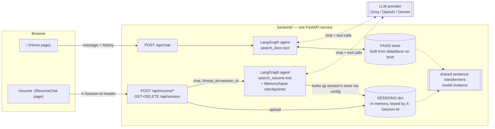
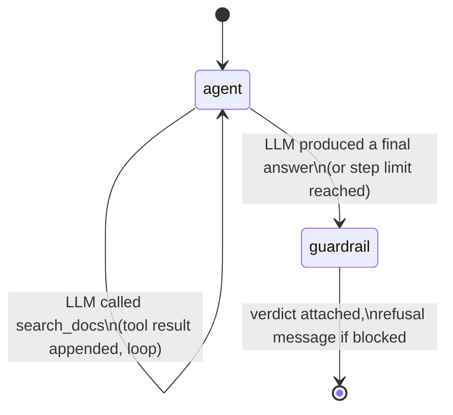
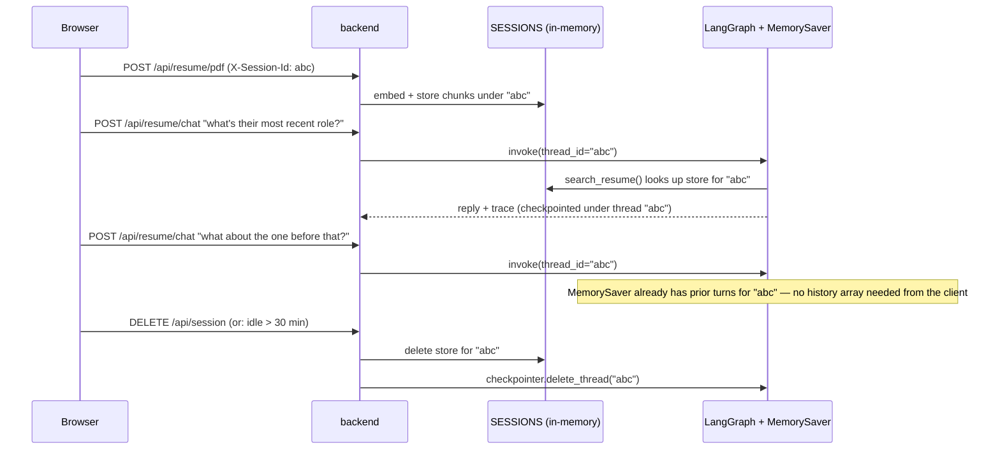
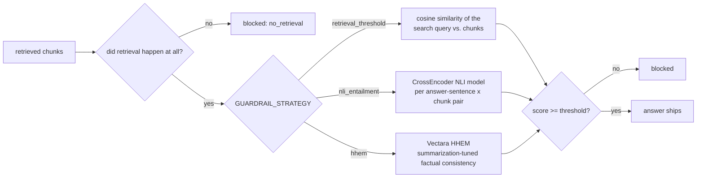

# Observability-first agentic RAG — one service, two agents, one frontend

Two small agents that answer questions from documents — and, unlike most RAG demos, show their work: what they retrieved, what it scored, which tools they called, how long each step took, how many tokens they spent, and whether a guardrail let the answer through.

**Why this exists:** most people don't trust AI answers they can't inspect. This project takes the observability practices used in production LLM systems (tracing, evaluation, guardrails) and puts them directly in front of the end user instead of hiding them in an internal dashboard.

Repo: https://github.com/gvdnikhil/rag-observability-agent

One backend (`backend/`), two logical route groups, one frontend (two pages):

| Agent | Page | Routes | What it answers about | Data lifetime |
|---|---|---|---|---|
| Nimbus | `/` | `POST /api/chat` | A fixed sample knowledge base (`backend/app/data/docs/`) | Rebuilt on every boot, same for everyone |
| Resume Agent | `/resume` | `POST /api/resume/*`, `GET`/`DELETE /api/session`, `POST /api/resume/chat` | Whatever resume *you* just uploaded | Per-browser-session, in memory only, gone on tab close / idle timeout / "Clear my data" |

**Why one service, not two microservices:** they started as separate Railway deployments, but both load their own copy of the `sentence-transformers` embedding model (~300-500MB with torch) — running two containers means paying that RAM cost twice for no benefit on a free tier. The two agents' code was already ~90% identical (`llm/`, `rag/`, `guardrails.py`, `observability.py`), so merging into one process with one shared embedding-model instance (see `rag/store.py`'s model cache) was the pragmatic call: a "modular monolith" — two clearly-separated route groups and agent graphs, one deployable unit.

## What each agent does

1. You ask a question in the chat UI.
2. The agent (built on **LangGraph**) decides whether it needs to search its knowledge base, and calls a tool if so — it can call it more than once if the first search wasn't enough.
3. Retrieval runs against a **FAISS** index built from local embeddings (`sentence-transformers`, no API cost, one shared model instance for both agents).
4. A **guardrail** checks the retrieved evidence before the answer ships: if nothing relevant was found, or the best match is below a similarity threshold, the agent refuses instead of guessing. (Nimbus and the Resume Agent use different thresholds — see "Why these specific choices" below.)
5. The frontend renders the full trace next to the chat: retrieved chunks with similarity scores, tool calls made, per-call latency, token usage, and the guardrail's verdict.

## Architecture



### Nimbus agent loop (`backend/app/agent/graph.py`)



### Resume Agent: session lifecycle + memory (`backend/app/agent/resume_graph.py`, `backend/app/sessions.py`)



`sessionStorage` (not `localStorage`) holds the session id client-side, so it disappears when the tab closes — the server-side TTL sweep and the "Clear my data" button cover the cases a closed tab can't (multiple tabs, idle-but-open tabs, crashes).

Every pass through an `agent` node is one LLM call and is recorded as one trace step (latency + token usage + whether it called a tool). The `guardrail` node runs exactly once, after the loop ends, and checks the *final answer* — not just whether retrieval happened.

### Guardrail: three configurable strategies (`backend/app/services/guardrails.py`, `backend/app/config/guardrails.py`)



`retrieval_threshold` only checks that *something* relevant was found — it never looks at whether the generated answer is actually supported by it. `nli_entailment` and `hhem` both score the *answer itself* against its context instead of the query, which is the real question a groundedness guardrail should be asking — see `config/guardrails.py` for why `retrieval_threshold` is still the default despite that.

## Why these specific choices

| Decision | Why |
|---|---|
| **One service, two route groups, not two microservices** | See above — the RAM cost of two separate embedding-model instances wasn't worth the deploy-isolation benefit at this scale. |
| **One shared embedding-model instance (`rag/store.py`'s `_MODEL_CACHE`)** | Every `VectorStore()` — Nimbus's one at boot, and each resume session's own — reuses the same loaded model instead of each paying the load cost separately. Also fixes a real inefficiency the Resume Agent had standalone: it was loading a fresh model on *every single upload*. |
| **FAISS in-memory, rebuilt on boot / per session** | No external vector DB to run or pay for at this content size. Rebuild cost is milliseconds for a handful of docs. |
| **`sentence-transformers` for embeddings** | Runs locally, free, no API key — only the *generation* step costs anything, and that's on a free tier too. |
| **LangGraph for orchestration** | The retrieve → guardrail → generate loop is genuinely stateful (it can loop), which is what LangGraph is for — a plain function chain can't express "call the tool again if the first search wasn't enough." |
| **LangGraph `MemorySaver` for the resume agent's conversation memory** | Conversation state (per browser session) is owned by the checkpointer, keyed by `thread_id = session_id`, instead of the client resending a growing `history` array every request. |
| **Custom `LLMProvider` abstraction instead of calling Groq's SDK directly** | Swapping to OpenAI or Gemini is an env var change (`LLM_PROVIDER`), not a rewrite — see `backend/app/llm/`. |
| **Guardrail strategy is a config switch, not a single hard-coded check** | Went through three approaches trying to get groundedness checking right (see issue #4): a cosine-similarity retrieval-confidence check, a generic NLI entailment cross-encoder, and Vectara's purpose-built HHEM model. Rather than replace one with the next each time, all three live side by side behind `GUARDRAIL_STRATEGY` in `config/guardrails.py` — nothing gets thrown away when a new approach is tried, and the tradeoffs of each are documented right where you'd flip the switch. |
| **`retrieval_threshold` is the default** | Cheapest and most reliable of the three in testing. It only checks that *something* relevant was found (not whether the answer is truly supported by it), but the alternatives had real problems: generic NLI models under-score legitimate paraphrasing (a correct answer scored 0.01 entailment against its own correct source), and HHEM — the model actually built for this — currently crashes on this project's `transformers` version. |
| **Two different retrieval thresholds, not one** | Nimbus's prose docs and the Resume Agent's short fragments score very differently against the same embedding model for the *same reason* an answer's phrasing affects NLI scoring — short, keyword-heavy text and full sentences aren't comparable inputs to any similarity-based check. `GUARDRAIL_SIMILARITY_THRESHOLD_NIMBUS` (0.3) and `_RESUME` (0.15) are separate, both configurable. |
| **Trace returned inline in the API response, not shipped to Prometheus/Grafana** | The audience for the trace is the end user, not an ops team — so it's rendered directly in the product instead of a separate observability stack. |

## Project structure

Standard FastAPI production layout — routers, services, and config each have one job, so nothing is both an HTTP handler and a business-logic function at once.

```
backend/
  app/
    main.py                    FastAPI app instance, router registration, startup wiring — no business logic
    schemas.py                 all Pydantic request models
    config/                    settings, section by section — every value has a sample default, override via env var
      app.py                    LOG_LEVEL, CORS_ORIGINS
      llm.py                    LLM_PROVIDER, LLM_API_KEY, LLM_MODEL, per-provider defaults
      guardrails.py             GUARDRAIL_STRATEGY + settings for all three strategies
      session.py                SESSION_TTL_SECONDS, SESSION_SWEEP_INTERVAL_SECONDS
      resume.py                 RESUME_MAX_PAGES, RESUME_PDF_EXTRACTION_MODE
    api/                       HTTP layer — routers only
      nimbus.py                  POST /api/chat
      resume.py                  POST /api/resume/*, GET+DELETE /api/session, POST /api/resume/chat
      health.py                  GET /api/health
    agents/                    LangGraph graphs
      nimbus_graph.py            search_docs tool, no memory
      resume_graph.py            search_resume tool, MemorySaver checkpointer
    services/                  business logic, framework-agnostic
      rag/                       ingest.py (chunking) + store.py (FAISS wrapper, shared model cache)
      guardrails.py              the three-strategy dispatcher
      sessions.py                in-memory SESSIONS dict + TTL sweep
      resume_parse.py            PDF -> text (pypdf)
      observability.py           trace object + summary stats
    llm/                       provider abstraction (base.py, openai_compatible.py, gemini_provider.py, factory.py)
    data/docs/                 Nimbus's sample knowledge base (swap for your own notes)

frontend/                 One React app, three routes
  src/
    main.jsx               react-router-dom routes: "/", "/resume", "/about"
    pages/Home.jsx          Nimbus demo page
    pages/ResumeChat.jsx    upload screen -> chat + trace panel, "Clear my data"
    pages/About.jsx         how it works / privacy explanation
    lib/session.js          sessionStorage-backed session id + fetch wrapper
    lib/resumeApi.js         Resume Agent API client (same base URL as Nimbus, different paths)
    lib/theme.js             light/dark mode persistence
    api.js                  Nimbus API client
    components/             ChatPanel, TracePanel, ScoreBar, StatChip, StatusDot, ThemeToggle (shared by both pages)
```

## Running locally

**Backend** (port 8000, serves both agents)
```bash
cd backend
python -m venv .venv
.venv\Scripts\activate        # or source .venv/bin/activate on macOS/Linux
pip install -r requirements.txt
copy .env.example .env        # then fill in LLM_API_KEY
uvicorn app.main:app --reload --port 8000
```

**Frontend**
```bash
cd frontend
npm install
npm run dev
```

- On `/`: ask something answerable from `backend/app/data/docs/` (e.g. "What deployment modes does Nimbus support?"), then ask something unrelated and watch the guardrail refuse.
- On `/resume`: upload a resume (PDF or pasted text), ask about it, ask something unrelated to see the same guardrail refuse, ask a follow-up ("what about the one before that?") to see LangGraph's memory carry context, then hit "Clear my data".

## Swapping in your own knowledge base (Nimbus)

Replace the markdown files in `backend/app/data/docs/` with your own notes — the index rebuilds from whatever is in that folder on every backend start. No code changes needed.

## Swapping the LLM provider

Set in `backend/.env`:
```
LLM_PROVIDER=groq | openai | gemini
LLM_API_KEY=...
LLM_MODEL=...        # optional, sensible default per provider
```

## Configuration reference

Every setting lives in `backend/app/config/` (one file per section — `app.py`, `llm.py`, `guardrails.py`, `session.py`, `resume.py`), each documented with sample values inline. Override any of them via `backend/.env`:
```
LOG_LEVEL=INFO

# Guardrail — see config/guardrails.py for the tradeoffs of each strategy
GUARDRAIL_STRATEGY=retrieval_threshold   # retrieval_threshold | nli_entailment | hhem
GUARDRAIL_SIMILARITY_THRESHOLD_NIMBUS=0.3
GUARDRAIL_SIMILARITY_THRESHOLD_RESUME=0.15
GUARDRAIL_NLI_MODEL=cross-encoder/nli-deberta-v3-xsmall
GUARDRAIL_ENTAILMENT_THRESHOLD=0.3
GUARDRAIL_HHEM_MODEL=vectara/hallucination_evaluation_model
GUARDRAIL_HHEM_THRESHOLD=0.5

SESSION_TTL_SECONDS=1800                      # idle resume sessions swept after this many seconds
SESSION_SWEEP_INTERVAL_SECONDS=300            # how often the sweep runs
RESUME_MAX_PAGES=20                           # PDF pages read per upload
RESUME_PDF_EXTRACTION_MODE=plain              # or "layout" (pypdf extraction modes)
```

## Deployment

- **Backend** → Railway, root directory `backend/`, one service.
- **Frontend** → Vercel, root directory `frontend/`, `VITE_API_URL` pointing at the Railway backend's public URL (used by both agents' API clients).
